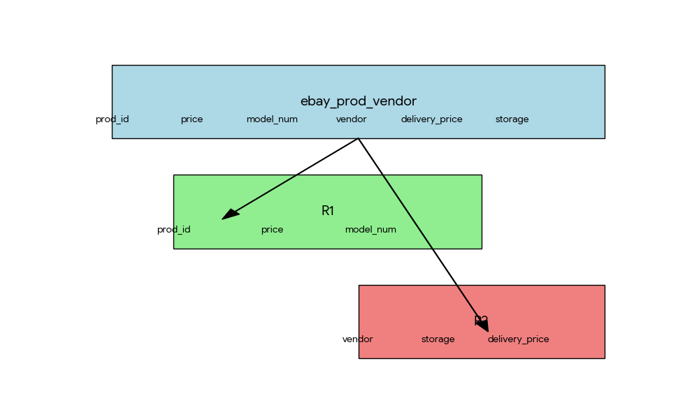

# Normalisation
* Name: Panda Ma
* ID: 101061823


## Q1. (20 marks)

Let ebay `prod_vendor=(prod_id, price, model_num, vendor, delivery_price, storage)` be a relation scheme. And let the following be the FDs that hold on ebay prod vendor:

`prod_id -> price model_num`

`vendor storage -> delivery_price`

Decompose ebay prod_vendor into a (*set of*) relational schemes via a lossless-join decomposition, and explain why it is indeed a **lossless-join decomposition** (*namely, show briefly that the criterion for lossless-join decomposition described in class holds on your relations*).

### **Answer:**



Based on the given functional dependencies, we can decompose `prod_vendor` into the following two relation schemes:

* `R1(prod_id, price, model_num)`
* `R2(vendor, storage, delivery_price)`

This decomposition is a lossless-join decomposition because `prod_id -> price model_num` is a primary key for $R_1$, and `vendor storage -> delivery_price` is a primary key for $R_2$. According to the criterion for lossless-join decomposition, if at least one of the decomposed relation schemes contains the primary key of the original relation scheme, or contains the primary key of another decomposed relation scheme, then the decomposition is lossless-join.

In this case, $R_1$ contains part of the primary key (`prod_id`) of the original relation scheme `prod_vendor`, thus satisfying the condition for lossless-join decomposition. Similarly, $R_2$ contains part of the primary key (`vendor storage`) of the original relation scheme `prod_vendor`, thus satisfying the condition for lossless-join decomposition.

Therefore, the decomposition of `prod_vendor` into $R_1$ and $R_2$ is a lossless-join decomposition.

## Q2. (20 marks)
Let $R = (A, B, C, D)$ be a relation schema and let $F = \{C →D, C → A, B → C\}$ be a set of FDs. Is R in Boyce-Codd normal form (BCNF) with respect to F ? If it is **plain why**, otherwise **decompose** $R$ into a set of schemas in BCNF.
### **Answer:**

Let's analyse whether this relation schema $R (A, B, C, D)$  meets the criteria for Boyce-Codd Normal Form (BCNF).
As this graph shows, the closure of $C$ is $\{A, C, D\}$, which does not include attribute $B$. This means that $C$ is not a superkey of $R$, and the relation schema $R$ does not satisfy BCNF.

```asymptote
size(200); // Set the size of the graph
pair A,B,C,D,R1,R2;

// Define the position of the points
A = (0,1);
B = (1,1);
C = (1,0);
D = (0,0);
R1 = (0.5,0.2); // Position of point R1
R2 = (0.5,0.8); // Position of point R2

// Draw the rectangle and diagonal
draw(A--B--C--D--A);
draw(A--C);

// Mark the position of the points and labels
label("$A$", A, NW);
label("$B$", B, NE);
label("$C$", C, SE);
label("$D$", D, SW);
label("$R$", R2, N);
label("$R_1$", R1, S); // Use mathematical mode to mark R_1

// Add an arrow in R1 to represent C → D
draw(C--D,Arrow(6));
label("$D \leftarrow C$", (0.4,-0.06), NE, fontsize(8));

// Add an arrow in R2 to represent B → C
draw(B--C,Arrow(6));
label("$B$", (B + C)/2, NE, fontsize(8));
label("$\downarrow$", (1.006,0.45), NE, fontsize(8));
label("$C$", (1,0.4), NE, fontsize(8));

// Add an arrow in R2 to represent C → A
draw(C--A,Arrow(6));
label("$A$", (0.46,0.54), NE, fontsize(8));
label("$\nwarrow$", (0.5,0.49), NE, fontsize(8));
label("$C$", (0.545,0.455), NE, fontsize(8));
```


BCNF Requirement For every non-trivial functional dependency $X → Y$ in relation schema $R$, $X$ must be a superkey of $R$. In simpler terms, the determinant $X$ must be able to uniquely identify every tuple in relation $R$.

Analysis  The given set of functional dependencies $F = \{C → D, C → A, B → C\}$ reveals the dependencies between the attributes. However, the functional dependencies $C → D$ and $C → A$ violate the BCNF requirement. This is because the closure of $C$ is $\{A, C, D\}$, which does not include attribute $B$, meaning $C$ is not a superkey of $R$.

Decomposition  To achieve BCNF compliance for R, we need to decompose it. The goal of decomposition is to eliminate redundancy and improve data integrity. By carefully analysing the functional dependencies, we can decompose R into the following two relation schemas:

$R_1(C, D, A)$ (Determined by $C → D$, $C → A$) 

$R2(B, C)$ (Determined by $B → C$)

In both $R_1$ and $R_2$, each determinant is a superkey of its respective relation schema, thus satisfying BCNF.